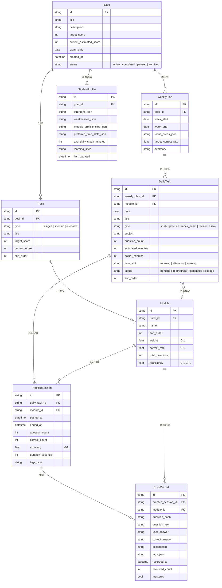

# 考公Agent 领域模型 & API 契约

本文档是编码合同，不是愿景文档。数据模型、状态流转、API 端点以此为准；前端、后端、测试和迁移脚本都从这里派生，不反向定义领域模型。

---

## 1. 实体关系图



### 关键决策

**WeeklyPlan 挂在 Goal 下，不挂在 Module 下。**

一周计划天然跨模块混合，比如周一资料分析 + 言语，周三申论作文，周末模考。挂在 Module 下会把一周拆成多个空壳计划，或者错误地表达成“本周只学一个模块”。模块维度通过 `DailyTask.module_id` 表达。

**DailyTask 是计划层，PracticeSession 是事实层。**

`DailyTask` 只说明计划要做什么；`PracticeSession` 记录实际做了多少题、对了多少题、耗时多久。画像、正确率和自适应计划只能基于事实层计算。

**StudentProfile 是派生缓存。**

前端不直接编辑画像字段；后端 profile service 根据 `PracticeSession`、`ErrorRecord`、`DailyTask` 重算后写入缓存，便于 UI 快速读取。

---

## 2. 表结构

```sql
goals:
  id TEXT PRIMARY KEY,
  title TEXT NOT NULL,
  description TEXT NOT NULL DEFAULT '',
  target_score INTEGER NOT NULL,
  current_estimated_score INTEGER NOT NULL DEFAULT 0,
  exam_date DATE NOT NULL,
  created_at DATETIME NOT NULL,
  status TEXT NOT NULL

tracks:
  id TEXT PRIMARY KEY,
  goal_id TEXT NOT NULL REFERENCES goals(id),
  type TEXT NOT NULL,
  title TEXT NOT NULL,
  target_score INTEGER NOT NULL,
  current_score INTEGER NOT NULL DEFAULT 0,
  sort_order INTEGER NOT NULL

modules:
  id TEXT PRIMARY KEY,
  track_id TEXT NOT NULL REFERENCES tracks(id),
  name TEXT NOT NULL,
  sort_order INTEGER NOT NULL,
  weight REAL NOT NULL DEFAULT 0,
  correct_rate REAL NOT NULL DEFAULT 0,
  total_questions INTEGER NOT NULL DEFAULT 0,
  proficiency REAL NOT NULL DEFAULT 0

weekly_plans:
  id TEXT PRIMARY KEY,
  goal_id TEXT NOT NULL REFERENCES goals(id),
  week_start DATE NOT NULL,
  week_end DATE NOT NULL,
  focus_areas_json TEXT NOT NULL DEFAULT '[]',
  target_correct_rate REAL NOT NULL DEFAULT 0,
  summary TEXT NOT NULL DEFAULT ''

daily_tasks:
  id TEXT PRIMARY KEY,
  weekly_plan_id TEXT NOT NULL REFERENCES weekly_plans(id),
  module_id TEXT NOT NULL REFERENCES modules(id),
  date DATE NOT NULL,
  title TEXT NOT NULL,
  type TEXT NOT NULL,
  subject TEXT NOT NULL,
  question_count INTEGER NOT NULL DEFAULT 0,
  estimated_minutes INTEGER NOT NULL DEFAULT 0,
  actual_minutes INTEGER NOT NULL DEFAULT 0,
  time_slot TEXT NOT NULL,
  status TEXT NOT NULL,
  sort_order INTEGER NOT NULL

practice_sessions:
  id TEXT PRIMARY KEY,
  daily_task_id TEXT NOT NULL REFERENCES daily_tasks(id),
  module_id TEXT NOT NULL REFERENCES modules(id),
  started_at DATETIME NOT NULL,
  ended_at DATETIME NOT NULL,
  question_count INTEGER NOT NULL,
  correct_count INTEGER NOT NULL,
  accuracy REAL NOT NULL,
  duration_seconds INTEGER NOT NULL,
  tags_json TEXT NOT NULL DEFAULT '[]'

error_records:
  id TEXT PRIMARY KEY,
  practice_session_id TEXT NOT NULL REFERENCES practice_sessions(id),
  module_id TEXT NOT NULL REFERENCES modules(id),
  question_hash TEXT NOT NULL,
  question_text TEXT NOT NULL,
  user_answer TEXT NOT NULL,
  correct_answer TEXT NOT NULL,
  explanation TEXT NOT NULL DEFAULT '',
  tags_json TEXT NOT NULL DEFAULT '[]',
  recorded_at DATETIME NOT NULL,
  reviewed_count INTEGER NOT NULL DEFAULT 0,
  mastered BOOLEAN NOT NULL DEFAULT false

student_profiles:
  id TEXT PRIMARY KEY,
  goal_id TEXT NOT NULL UNIQUE REFERENCES goals(id),
  strengths_json TEXT NOT NULL DEFAULT '[]',
  weaknesses_json TEXT NOT NULL DEFAULT '[]',
  module_proficiencies_json TEXT NOT NULL DEFAULT '{}',
  preferred_time_slots_json TEXT NOT NULL DEFAULT '[]',
  avg_daily_study_minutes INTEGER NOT NULL DEFAULT 0,
  learning_style TEXT NOT NULL DEFAULT '',
  last_updated DATETIME NOT NULL

user_settings:
  id TEXT PRIMARY KEY,
  key TEXT NOT NULL UNIQUE,
  value TEXT NOT NULL,
  updated_at DATETIME NOT NULL
```

### 索引

```sql
CREATE INDEX idx_goals_status ON goals(status);
CREATE INDEX idx_tracks_goal ON tracks(goal_id, sort_order);
CREATE INDEX idx_modules_track ON modules(track_id, sort_order);
CREATE INDEX idx_weekly_plans_goal_week ON weekly_plans(goal_id, week_start, week_end);
CREATE INDEX idx_daily_tasks_week_date ON daily_tasks(weekly_plan_id, date, time_slot, sort_order);
CREATE INDEX idx_daily_tasks_module ON daily_tasks(module_id);
CREATE INDEX idx_practice_sessions_task ON practice_sessions(daily_task_id);
CREATE INDEX idx_practice_sessions_module_time ON practice_sessions(module_id, started_at);
CREATE INDEX idx_error_records_module_mastered ON error_records(module_id, mastered);
CREATE UNIQUE INDEX idx_error_records_session_hash ON error_records(practice_session_id, question_hash);
```

---

## 3. 状态流转

### 3.1 Goal

```text
active -> paused -> active
  |                  ^
  +-> completed      |
  +-> archived
```

- `active`: 当前备考目标。Phase 1 一个用户同时只有一个 active Goal。
- `paused`: 暂停，可恢复为 active。
- `completed`: 考试结束，保留数据，不恢复。
- `archived`: 用户主动归档，隐藏但不删除。

### 3.2 DailyTask

```text
pending -> in_progress -> completed
  |                         ^
  +-> skipped --------------+
```

- `pending -> in_progress`: 用户开始执行。
- `in_progress -> completed`: 练习结束或学习任务完成。
- `pending -> skipped`: 用户跳过。
- `skipped -> completed`: 用户后续补做。

### 3.3 ErrorRecord

```text
mastered=false, reviewed_count=0
  -> reviewed_count=1
  -> reviewed_count=2
  -> mastered=true
```

规则版掌握条件：`reviewed_count >= 2` 且最近一次复习做对。后续可升级为 LLM 辅助判断。

---

## 4. 事务边界

### 4.1 创建练习记录

`POST /api/practice/session` 必须在同一个事务里完成：

1. 写入 `practice_sessions`。
2. 更新关联 `daily_tasks.actual_minutes`。
3. 若任务类型为 `practice` 或 `mock_exam`，将任务标记为 `completed`。
4. 重算对应 `modules.correct_rate`、`modules.total_questions`、`modules.proficiency`。
5. 重算并写入 `student_profiles` 派生缓存。

这样避免“练习记录已写入，但任务没完成”这类半成功状态。

### 4.2 批量记录错题

`POST /api/errors/batch` 必须在同一个事务里完成：

1. 逐条计算 `question_hash`。
2. 对同一 `practice_session_id + question_hash` 去重。
3. 写入新增错题。
4. 重算 profile 的 strengths/weaknesses。

---

## 5. MVP API 契约

Phase 1 只做 8 个端点。

### 5.1 规划

```http
GET /api/planner/goal
```

返回当前 active Goal + Tracks + Modules + 本周 WeeklyPlan + DailyTasks。如果不存在 active Goal，返回 `null`，前端触发 onboarding。

```http
POST /api/planner/generate
```

请求体：

```json
{
  "target_score": 150,
  "exam_date": "2026-11-29",
  "strengths": ["言语理解与表达"],
  "weaknesses": ["资料分析", "数量关系"]
}
```

Phase 1 使用规则引擎生成初始 Goal + Tracks + Modules + 本周 WeeklyPlan + 7 天 DailyTasks。返回完整树。

```http
GET /api/planner/today
```

返回今日所有 DailyTask，按 `time_slot` 分组。

```http
PATCH /api/planner/task/{id}
```

请求体：

```json
{
  "status": "in_progress",
  "actual_minutes": 25,
  "sort_order": 2
}
```

仅允许更新 `status`、`actual_minutes`、`time_slot`、`sort_order`。不允许通过此接口改 `title`、`type`、`module_id`，这些属于计划调整职责。

```http
POST /api/planner/adapt
```

根据本周完成情况和最近 PracticeSession 表现调整下周计划。Phase 1 使用规则引擎：如果某模块 `correct_rate < target_correct_rate`，下周该模块任务数量增加 20%。

### 5.2 练习与错题

```http
POST /api/practice/session
```

请求体：

```json
{
  "daily_task_id": "task_1",
  "module_id": "module_data_analysis",
  "question_count": 30,
  "correct_count": 22,
  "duration_seconds": 1800,
  "tags": ["增长率", "同比"]
}
```

返回 session、更新后的 task、module、profile 摘要。

```http
POST /api/errors/batch
```

请求体：

```json
{
  "practice_session_id": "session_1",
  "errors": [
    {
      "module_id": "module_data_analysis",
      "question_text": "题干文本",
      "user_answer": "A",
      "correct_answer": "C",
      "explanation": "解析文本",
      "tags": ["增长率"]
    }
  ]
}
```

### 5.3 画像

```http
GET /api/profile
```

返回当前 StudentProfile：强弱项列表、各模块熟练度、偏好时段、日均学习时长、学习风格。

---

## 6. MVP 用户流程

### 6.1 初始测评 -> 生成计划

```text
用户打开 App，无 active Goal
  -> 前端展示 onboarding
  -> 用户输入目标分数、考试日期、自评强弱项
  -> POST /api/planner/generate
  -> 返回完整计划树
  -> 前端渲染右栏工作台
```

### 6.2 今日任务 -> 完成练习

```text
用户打开 App，有 active Goal
  -> GET /api/planner/today
  -> 前端展示今日任务列表
  -> 用户完成练习
  -> POST /api/practice/session
  -> POST /api/errors/batch
  -> 前端用返回的 task/module/profile 更新工作台
```

### 6.3 根据完成情况调整计划

```text
用户在周日查看本周总结
  -> 前端展示完成率、模块正确率趋势、错题数
  -> 用户点击“调整下周计划”
  -> POST /api/planner/adapt
  -> 返回新的 WeeklyPlan + DailyTasks
  -> 前端更新计划栏
```

---

## 7. 画像计算

Phase 1 直接计算，不调 LLM：

```text
proficiency = correct_rate * 0.6 + consistency * 0.2 + recency * 0.2
```

| 参数 | 含义 | 计算方式 |
|------|------|----------|
| `correct_rate` | 该模块历史正确率 | 所有 PracticeSession 的 total correct / total questions |
| `consistency` | 稳定性 | 最近 5 次 session 正确率标准差的反比，映射到 0-1 |
| `recency` | 时效衰减 | 最近一次练习距今 N 天，`max(0, 1 - N/30)` |

强弱项规则：

- `proficiency >= 0.7`: 强项
- `proficiency < 0.4`: 弱项
- 其他：普通模块

---

## 8. 不入库内容

| 内容 | 存储位置 | 理由 |
|------|----------|------|
| Agent 会话消息 | `backend/memory/sessions/{session_id}.jsonl` | append-only 流数据，不适合关系表 |
| Agent 人格/Prompt | `backend/agents/prompts/*.md` | 代码的一部分，跟随版本控制 |
| API Key / Model Endpoint | `backend/.env` | 和环境绑定 |
| MCP Server 定义 | `backend/config.yaml` | 基础设施配置 |
| Skill 定义 | `backend/config.yaml` | 同上 |
| UI 偏好 | `user_settings` | 简单键值对足够 |

---

## 9. Phase 1 不做

- LangGraph 复杂编排，先用规则引擎 + 直接 LLM 调用。
- 向量检索 / sqlite-vec。
- 申论批改 / 时政追踪。
- 文件上传。
- 出题官 Agent。
- WebSocket 推送，先用轮询。
- 多 Goal 并存。
